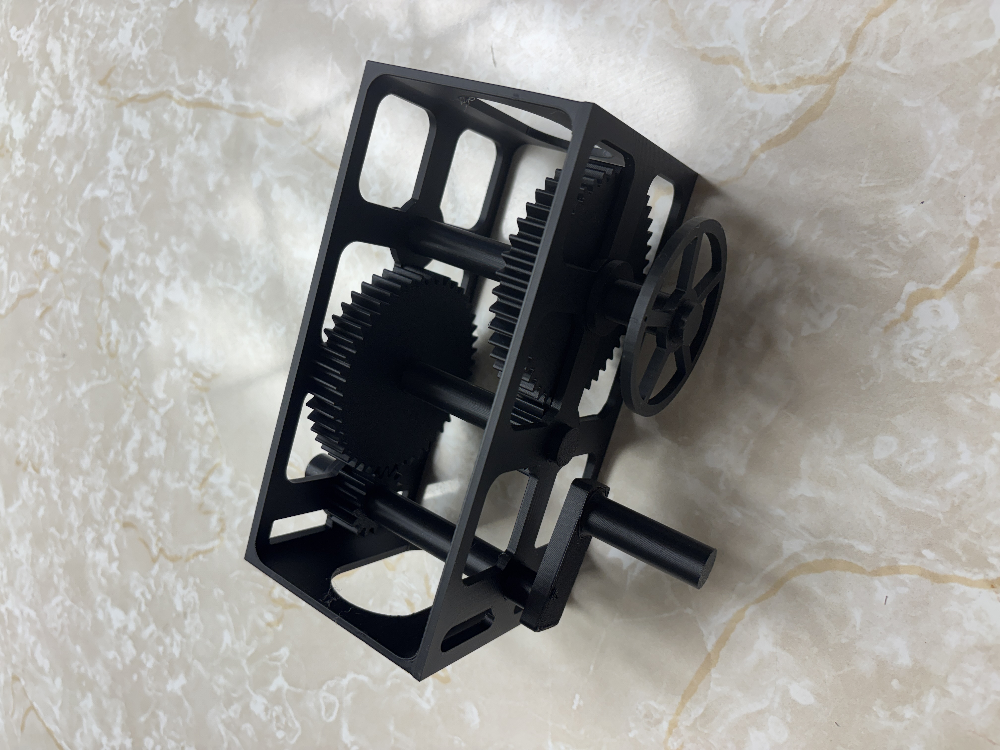
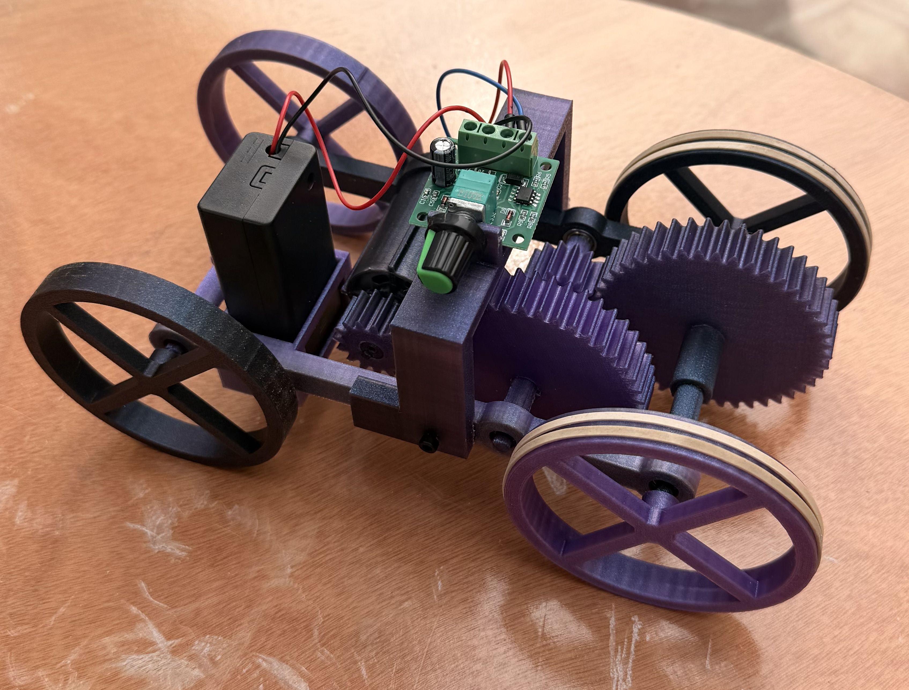
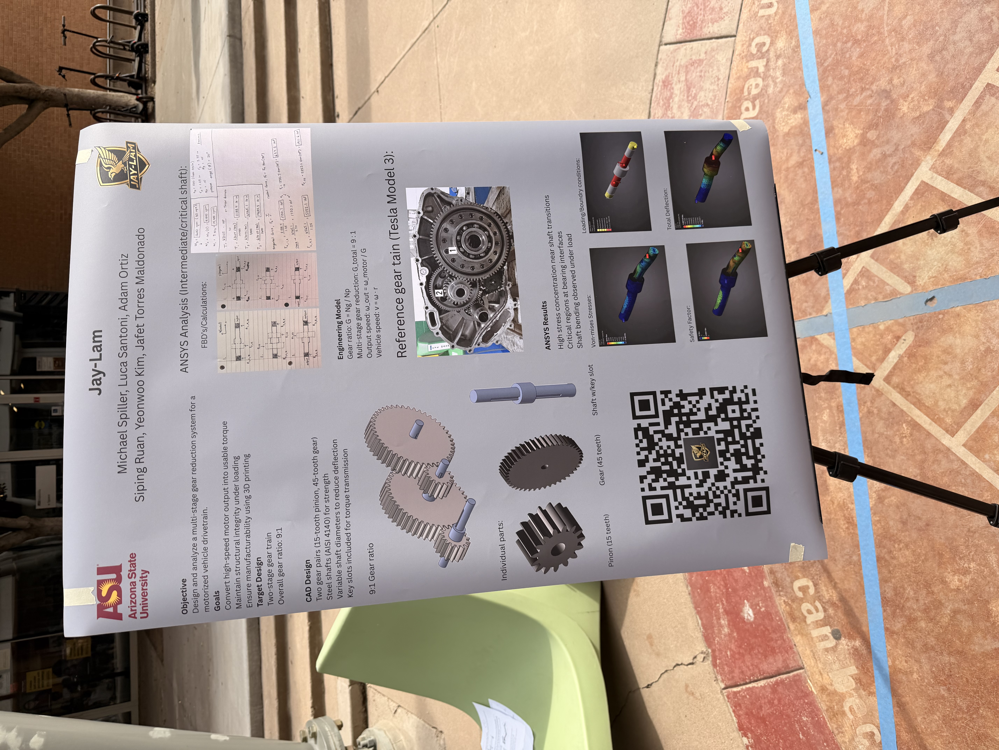

# MEE 342 Phase 3 Report

**Team:** Jay-Lam

**Team Members:** Michael Spiller, Luca Santoni, Adam Ortiz, Siping Ruan, Yeonwoo Kim, Jafet Torres Maldonado

---

## Prototype Iterations

### Prototype Iteration 1: Manual Gear Train Demonstration

The first prototype iteration was a simplified gear train demonstration. It used the printed gears and shafts with a hand-crank input. A single wheel was attached to the output shaft so the output rotation could be observed and counted.

This version was used to verify the basic gear train motion and confirm the expected 9:1 gear ratio. When the input shaft was rotated nine times by hand, the output wheel completed one full rotation.

### Prototype Iteration 2: Motorized Working Prototype

The second prototype iteration used the same gear dimensions as the first version, but it was upgraded into a working motorized model. Instead of only using a hand crank, the input shaft was driven by a motor. A speed-control dial was used to adjust the motor speed during operation.

The second prototype also used bearings to help support shaft rotation during powered operation. The output shaft was connected to two wheels wrapped with thin rubber tape. The tape increased traction so the wheels could grip better while turning. This version showed that the gear train not only had the correct 9:1 ratio, but also moved continuously under powered input.

### Presentation Poster

---

## 1. Fabrication Details

For Phase 3, the original design was modified so it could be manufactured as a 3D printed prototype. The goal of the prototype was to demonstrate the main gear reduction function of the design at a reduced scale and under safe operating conditions.

The first prototype iteration was a manual gear train demonstration. It included the printed gear train, a hand-crank input, and a single output wheel. This version was used to verify the expected 9:1 gear ratio by counting the number of input rotations required to produce one full output rotation.

The second prototype iteration used the same gear dimensions, but it was improved into a working motorized model. A motor was added to drive the input shaft, and a speed-control dial was added so the motor speed could be adjusted during operation. Bearings were used to support the shafts during motorized operation. The output shaft was connected to two wheels wrapped with thin rubber tape to improve traction while the wheels turned.

### Design Changes for 3D Printing

The model was modified from the original design to improve printability, simplify assembly, and allow the mechanism to be viewed during operation.

- Diametral pitch was changed from 6 teeth/in to 12 teeth/in.
- Gear face width was reduced from 1.5 in to 0.5 in.
- Shaft diameter was changed to a uniform 0.5 in diameter.
- No keyway was used in the 3D printed prototype.
- A hand crank was added to the input shaft for the first prototype iteration.
- A single output wheel was added to the first prototype iteration to show output rotation.
- A motor was added to the second prototype iteration to drive the input shaft.
- Bearings were used in the second prototype iteration to support shaft rotation.
- A speed-control dial was added to adjust the motor speed during operation.
- The output shaft was connected to two wheels.
- Thin rubber tape was added around the wheels to improve traction while turning.
- The housing was skeletonized so the moving parts could be viewed during operation.

These changes made the prototype easier to print and assemble while still allowing the gear train motion and speed reduction to be demonstrated. The first iteration verified the 9:1 gear ratio manually, while the second iteration showed continuous powered operation using the same gear dimensions.

### 3D Print Parameters

| Parameter | Value |
|---|---|
| Printer | Bambu Lab P1S |
| Filament | Elegoo PLA, black |
| Infill | 25% gyroid |
| Wall loops | 2 for gears, 1 for everything else |
| Total filament used | 258 g |
| Number of reprints | 0 |

### Print Preparation

The parts were prepared for 3D printing by simplifying the geometry and adjusting dimensions to better fit the limitations of the printing process. The gear teeth, shafts, and housing were modified so the parts could be printed and assembled more easily.

Because the prototype was designed for demonstration, the design did not include all final mechanical features from the original design. Keyways were removed from the printed shaft and gear interfaces to simplify manufacturing and assembly. The first iteration used a simpler manual setup, while the second iteration added a motor, bearings, a speed-control dial, and traction wheels to create a more complete working prototype.

The addition of the motor, speed-control dial, and traction wheels in the second iteration improved the final prototype by allowing the gear train to be operated continuously and by making the output wheel motion easier to observe.

---

## 2. Assembly Procedure and Challenges

After printing, the prototype was assembled manually. The assembly process focused on placing the gears and shafts into the housing, preventing the shafts from sliding out during operation, and adding visible output wheels for testing. The second iteration also included a motor connected to the input side, bearings, a speed-control dial, and two wheels connected to the output shaft.

### Assembly Procedure

1. The printed parts were inspected after printing.
2. The shafts were inserted into the gears.
3. The gear and shaft assemblies were placed into the housing.
4. Endcaps were placed on the outside of the shafts to prevent the shafts from moving during operation.
5. For the first iteration, a hand crank was attached to the input shaft.
6. For the first iteration, a single wheel was attached to the output shaft so the output rotation could be observed.
7. The first iteration was manually rotated to verify the 9:1 gear ratio.
8. For the second iteration, the same gear dimensions were used.
9. Bearings were used to support shaft rotation during powered operation.
10. A motor was added to the input shaft for the final working prototype.
11. A speed-control dial was connected so the motor speed could be adjusted during operation.
12. Two wheels were connected to the output shaft.
13. Thin rubber tape was wrapped around the wheels to improve traction.
14. The model was assembled using superglue on printed components.
15. The motorized version was operated to demonstrate continuous gear train motion and wheel rotation.

### Assembly Results

The assembly process was successful, and the prototype worked immediately after assembly. The first iteration demonstrated the gear train manually using a hand crank and a single output wheel. This confirmed that the printed gear train produced the expected 9:1 ratio.

The second iteration kept the same gear dimensions but added a motor-driven input, bearings, a speed-control dial, and two output wheels wrapped with thin rubber tape. This created a working powered prototype that moved continuously and allowed the output wheel motion to be observed during operation.

No major issues were observed with slippage or hole clearances, and no parts required reprinting.

### Assembly Challenges

No major assembly failures occurred. The main assembly limitation was that some features were simplified compared with a final mechanical design. In particular, the printed shaft and gear connections did not use keyways, and the components were assembled using adhesive rather than more serviceable mechanical fasteners.

The motorized version improved the demonstration, but it also made alignment, shaft support, adhesive strength, gear play, and wheel traction more important than they were during slow manual testing.

---

## 3. Test Procedures, Results, and Interpretation

The prototype was tested in two stages. The first iteration was tested manually using a hand-crank input and a single output wheel to confirm the gear ratio. The second iteration was tested as a motorized working model using the same gear dimensions, with the motor driving the input shaft and the output shaft driving two traction wheels.

Testing included manual gear ratio verification, smooth rotation, motorized operation, and gear play observation.

### Gear Ratio Test

The gear ratio was tested using the first prototype iteration. A single wheel was attached to the output shaft, and the input shaft was rotated by hand using the hand crank.

The output wheel completed one full rotation after the input shaft was rotated nine times. This verified the expected 9:1 gear reduction.

### Smooth Rotation Test

The input shaft was rotated manually during normal operation. The gears and shafts rotated smoothly without binding.

This showed that the printed clearances, shaft support, and assembly alignment were acceptable for low-speed manual operation.

### Motorized Operation Test

The second prototype iteration used the same gear dimensions as the first version, but the input shaft was driven by a motor. A speed-control dial was used to adjust the motor speed during operation.

The output shaft was connected to two wheels wrapped with thin rubber tape to improve traction. This test showed that the gear train did not only work as a manual demonstration. It also moved continuously under powered input and transferred motion to the output wheels.

### Gear Play Observation

A small amount of play was observed between the input shaft gear and the intermediate shaft gear. The amount of play was approximately 3 degrees.

This play was likely caused by the clearances between the 3D printed gear teeth, material flexibility, and the simplified printed gear geometry. Although the play did not prevent operation, it showed that the 3D printed prototype was less precise than a machined final design.

### Summary of Test Results

| Test | Prototype Iteration | Procedure | Result | Interpretation |
|---|---|---|---|---|
| Gear ratio test | Iteration 1 | Rotate hand-crank input until output wheel completes one full rotation | Output wheel rotated once after 9 input rotations | The expected 9:1 gear reduction was verified |
| Smooth rotation test | Iteration 1 and 2 | Rotate the input and observe gear movement | Prototype rotated smoothly without binding | Printed clearances and alignment were acceptable |
| Motorized operation test | Iteration 2 | Use motor to drive the input shaft, adjust speed with the dial, and observe the output wheels | Output wheels rotated continuously with added traction from rubber tape | The prototype successfully demonstrated powered gear reduction and output wheel motion |
| Gear play observation | Iteration 1 and 2 | Observe looseness between the input shaft gear and intermediate shaft gear | Approximately 3 degrees of play | Small gear play was present due to printed clearances and simplified supports |

---

## 4. Comparison With Phase 2 Predictions

The Phase 3 prototype closely followed the main plan from the Phase 2 design. In Phase 2, the gear train was designed with two gear pairs using 15-tooth pinions and 45-tooth driven gears, giving an overall gear reduction of 9:1. The Phase 3 prototype verified this same 9:1 reduction during manual testing, since the output wheel completed one full rotation after nine input rotations.

Phase 2 also planned for the 3D printed version to be scaled down by changing the diametral pitch from 6 teeth/in to 12 teeth/in. This was done in the Phase 3 prototype, allowing the gear train to keep the same reduction ratio while making the gears smaller and easier to print.

Several Phase 2 prototype decisions also carried into Phase 3. Phase 2 planned a smaller open housing to show rotation, PLA material, and adhesive assembly. These choices were reflected in the final printed prototype. The open housing made the gear motion visible, and the PLA/adhesive construction was sufficient for the low-load demonstration.

One difference from the Phase 2 plan was that Phase 2 originally described using a small handle on the input shaft in place of a motor for the printed prototype. The first Phase 3 iteration followed this manual approach with a hand-crank input and a single output wheel. The second Phase 3 iteration improved on this by adding a motor-driven input, speed-control dial, bearings, and two rubber-taped output wheels. This made the final prototype more complete because it showed continuous powered operation instead of only manual rotation.

The Phase 2 analysis also identified several risks, including fatigue failure, stress concentrations near bearing constraints, and the need to later finalize shaft key design. The Phase 3 prototype avoided high-load fatigue testing because it was a reduced-scale PLA demonstration model. However, the simplified prototype still reflected these concerns: no keyways were used, adhesive assembly was used, and the model was intended for demonstration rather than high-load operation.

| Phase 2 Prediction or Plan | Phase 3 Prototype Result | Comparison |
|---|---|---|
| Gear train should use two 15-tooth to 45-tooth gear pairs | Prototype kept the same gear reduction behavior | The measured output confirmed the expected 9:1 reduction |
| Diametral pitch should change from 6 teeth/in to 12 teeth/in for the printed prototype | Prototype used the scaled-down printed gear design | This made the gears smaller while preserving the gear ratio |
| Printed prototype should use a handle instead of a motor | Iteration 1 used a hand-crank input | The first prototype followed the Phase 2 plan |
| Prototype should show visible gear rotation | Housing was skeletonized | The moving gear train was visible during operation |
| PLA and adhesive assembly should be sufficient for a non-structural prototype | PLA and superglue were used | This worked for the demonstration and no reprints were needed |
| Shaft support should allow smooth rotation | Iteration 2 used bearings for improved shaft support | Bearings helped the motorized version operate smoothly |
| Fatigue and stress concerns should be considered for future improvement | Prototype was not tested under high load | The model was appropriate for low-load demonstration, but not full structural validation |
| Shaft key design was still unresolved in Phase 2 | No keyways were used in the printed prototype | This simplified assembly but reduced realism for torque transfer |
| Phase 3 should improve the prototype | Iteration 2 added a motor, speed-control dial, bearings, and rubber-taped wheels | The second prototype went beyond the original manual demonstration plan |

---

## 5. Failures, Mistakes, and Surprises

The prototype worked successfully on the first assembly and test. No parts required reprinting, and no major failures occurred during assembly, manual testing, or motorized operation. The mechanism rotated smoothly, demonstrated the expected 9:1 gear reduction, and operated with the motorized input.

One positive surprise was that the prototype functioned immediately after assembly. The printed clearances, gear alignment, shaft placement, and overall assembly were accurate enough for the gear train to run without major adjustments. The final motorized version also improved the demonstration by using a speed-control dial and rubber-wrapped output wheels to show controlled powered motion.

Although the prototype worked well, several design limitations were still identified:

- Approximately 3 degrees of play was observed between the input shaft gear and intermediate shaft gear.
- No keyways were used, so the shaft-gear connections were not representative of a final high-load design.
- Superglue was used to assemble the components, which may not be reliable under higher torque or long-term motorized operation.
- PLA was acceptable for a functional demonstration, but it is not ideal for a final gear train operating under higher load.
- The reduced gear face width made the gears easier to print but reduced strength compared with the original design.
- The output wheels required added traction, which was improved using thin rubber tape.
- Longer motorized testing would require stronger shaft supports, more durable interfaces, and more permanent motor mounting.

Overall, the immediate success of the prototype showed that the 3D print modifications, clearances, bearing support, and assembly approach were effective for demonstrating the core gear reduction function.

---

## 6. Version 2 Design Changes

The addition of the motor, speed-control dial, bearings, and output wheels already addressed several major improvements from the manual prototype. If another prototype iteration were made, the following changes would improve realism, durability, and test quality.

| Proposed Change | Reason |
|---|---|
| Improve motor mounting | A more rigid motor mount would improve alignment and reduce vibration |
| Improve bearing placement and retention | More precise bearing mounts would improve shaft alignment and reduce unwanted movement |
| Improve speed-control integration | A more permanent dial and wiring setup would make motor speed adjustment more reliable |
| Use higher strength adhesive or mechanical fasteners | This would reduce the chance of parts separating under motorized operation |
| Use machined aluminum gears | Aluminum gears would provide more precise tooth profiles, better strength, and improved wear resistance |
| Use stepped shafts | Stepped shafts would improve strength and help locate gears more accurately |
| Add keyways or set screws | These would improve torque transfer between the shafts and gears |
| Improve traction wheel design | Molded or fitted rubber wheels would provide better traction than taped wheels |
| Perform a load or traction test | This would measure how well the output wheels transfer motion before slipping |
| Add speed measurement data | Measuring input and output RPM would give a more quantitative comparison to the expected 9:1 ratio |
